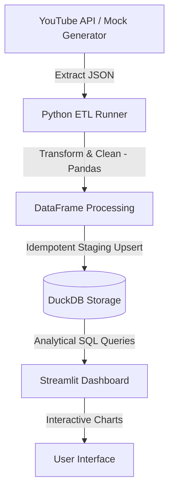

# YouTube Data Analytics ETL Pipeline

A modern, local-first data engineering project that implements an end-to-end ETL (Extract, Transform, Load) pipeline using the YouTube Data API v3, Python (Pandas), DuckDB, and Streamlit.

This project is built to demonstrate production-grade data engineering concepts:
- **API Extraction** with robust error-handling and a zero-dependency **Mock Data Fallback** (allows the pipeline and dashboard to run out-of-the-box without requiring API credentials).
- **Transformations** utilizing Pandas for data cleaning, timestamp standardization, duration parsing, and engagement metrics engineering.
- **Data Warehousing** inside DuckDB using a transactional **Staging-Upsert (Merge)** pattern to maintain idempotent pipeline runs (no duplicated rows if run multiple times).
- **Visualization** using a Streamlit web application populated with Plotly interactive charts.
- **Infrastructure & Containerization** utilizing Docker & Docker Compose.

---

## 🏗️ Architecture

1. **Extract**: Fetch search queries and metadata from YouTube Data API (e.g. video views, likes, comments, category, tag analysis, and channel statistics). Fallback to realistic mock data if API key is missing.
2. **Transform**: 
   - Parse ISO 8601 video durations into absolute seconds.
   - Extract and format timestamps.
   - Feature engineer metrics like `engagement_rate` ((likes + comments) / views) and `views_per_day`.
3. **Load**: Connect to local DuckDB file (`data/youtube_data.db`). Stage and upsert (update if exists, insert if new) records to ensure pipeline repeatability.
4. **Visualize**: Load metrics from the DB directly into Streamlit to render KPIs and Plotly plots.

---

## 📊 Database Schema

The pipeline creates and manages a relational schema in `data/youtube_data.db`:

### `channels`
| Column | Type | Description |
| :--- | :--- | :--- |
| `channel_id` (PK) | VARCHAR | Unique YouTube Channel identifier |
| `title` | VARCHAR | Channel display name |
| `description` | VARCHAR | Channel bio text |
| `published_at` | TIMESTAMP | Creation date of the channel |
| `subscriber_count` | BIGINT | Current total subscribers |
| `video_count` | INTEGER | Number of uploaded videos |
| `view_count` | BIGINT | Lifetime channel video views |
| `updated_at` | TIMESTAMP | Metadata ingestion timestamp |

### `videos`
| Column | Type | Description |
| :--- | :--- | :--- |
| `video_id` (PK) | VARCHAR | Unique YouTube Video identifier |
| `title` | VARCHAR | Video title |
| `description` | VARCHAR | Video description |
| `published_at` | TIMESTAMP | Upload timestamp |
| `channel_id` | VARCHAR | Foreign reference to channel |
| `channel_title` | VARCHAR | Channel name at ingestion |
| `category_id` | VARCHAR | YouTube category grouping |
| `tags` | VARCHAR | Comma-separated video tag list |
| `duration_seconds` | INTEGER | Parsed video duration in seconds |
| `view_count` | BIGINT | Total view count |
| `like_count` | BIGINT | Total likes |
| `comment_count` | BIGINT | Total comments |
| `engagement_rate` | DOUBLE | Calculated engagement ratio |
| `views_per_day` | DOUBLE | Velocity of views since release |
| `days_since_published` | INTEGER | Total age of the video in days |
| `thumbnail_url` | VARCHAR | High-res image link |
| `updated_at` | TIMESTAMP | Pipeline execution timestamp |

---
